<div align="center">

<h1 style="font-family: 'Cooper Black', 'Arial Black', serif; font-size: 3.8rem; letter-spacing: 2px; color: #00ff99; margin-bottom: 2px; text-shadow: 0 0 25px rgba(0, 255, 153, 0.45);">
  🛸 DRONETV AI 🛸
</h1>

<h3 style="font-family: 'Bookman Old Style', 'URW Bookman', 'Georgia', serif; font-weight: 500; color: #00d4ff; margin-top: 6px; letter-spacing: 0.8px;">
  ◈ <i>"AI Support & Lead Assistant — Enterprise Autonomous Aerial Ecosystem"</i> ◈
</h3>

<br/>

[](#)
[](#)
[](#)
[](#)
[](#)
[](#)
[](LICENSE)

<br/>

<p align="center" style="font-family: 'Bookman Old Style', 'URW Bookman', serif; font-size: 1.05rem;">
  <b>✦ <a href="#01-platform-overview">Platform Overview</a> ✦</b> &nbsp;•&nbsp;
  <b>✦ <a href="#02-interface-hud-preview">Interface Preview</a> ✦</b> &nbsp;•&nbsp;
  <b>✦ <a href="#03-telemetry--architecture-metrics">Telemetry Metrics</a> ✦</b> &nbsp;•&nbsp;
  <b>✦ <a href="#04-rule-engine--event-logic">Rule Engine Logic</a> ✦</b> &nbsp;•&nbsp;
  <b>✦ <a href="#05-system-architecture">Architecture</a> ✦</b> &nbsp;•&nbsp;
  <b>✦ <a href="#06-rest-api--endpoints">REST API</a> ✦</b> &nbsp;•&nbsp;
  <b>✦ <a href="#07-directory-structure">Structure</a> ✦</b> &nbsp;•&nbsp;
  <b>✦ <a href="#08-quick-start">Quick Start</a> ✦</b> &nbsp;•&nbsp;
  <b>✦ <a href="#09-operational-workflows">Workflows</a> ✦</b> &nbsp;•&nbsp;
  <b>✦ <a href="#10-candidate--submission">Candidate & Connect</a> ✦</b>
</p>

---

</div>

<h2 id="01-platform-overview" style="font-family: 'Bookman Old Style', 'URW Bookman', 'Georgia', serif; color: #00ff99;">🌌 01. Platform Overview</h2>

<p style="font-family: 'Bookman Old Style', 'URW Bookman', serif; font-size: 1.05rem; line-height: 1.7;">
<b>DroneTV AI Support & Lead Assistant</b> is a mission-grade, full-stack enterprise web application built for the <b>IPAGE Group Full Stack Developer Intern</b> practical technical assessment. Inspired by the commercial aerial capabilities of <b>DroneTV.in</b>, the platform unifies an intelligent rule-based conversational assistant, a dual-layer validated customer/student lead intake pipeline, and a real-time reactive Administrative CRM Command Center.
</p>

<p style="font-family: 'Bookman Old Style', 'URW Bookman', serif; font-size: 1.05rem; line-height: 1.7;">
The application is wrapped in a bespoke <b>Cyber-Aerospace Glassmorphic Design System</b> featuring physical <b>3D Weight-Tilt Dynamics</b> (cards sink under physical cursor mass while opposite edges rise forward), a micro-rendered <b>Vector Drone Quadcopter Cursor</b> with spinning navigation rotors and a glowing particle contrail, and a browser-synthesized <b>Web Audio Telemetry Sound Engine</b>.
</p>

```
  ┌─────────────────────────┐      ┌─────────────────────────┐      ┌─────────────────────────┐
  │  🛸 Aerospace Frontend  │ ──❯  │ 🛡️ Express REST Gateway  │ ──❯ │ 🗄️ Resilient Datastore  │
  │ React 18 + TS + 3D Tilt │      │ Zod + Helmet + RateLimit│      │ MongoDB / In-Memory Repo│
  └─────────────────────────┘      └─────────────────────────┘      └─────────────────────────┘
```

> [!NOTE]
> **Zero External LLM Dependency**: As mandated by IPAGE Group guidelines, the conversational assistant operates on a high-precision, deterministic keyword & pattern recognition engine. This guarantees **zero API cost, zero external downtime, and sub-15ms response latency** while delivering 100% accurate responses for all commercial and DGCA flight training inquiries.

---

<h2 id="02-interface-hud-preview" style="font-family: 'Bookman Old Style', 'URW Bookman', 'Georgia', serif; color: #00ff99;">📸 02. Interface HUD Preview</h2>

<div align="center">

### ◈ 1. Mission Boot — DroneTV Cinematic Radar & Audio Initialization
<kbd>
  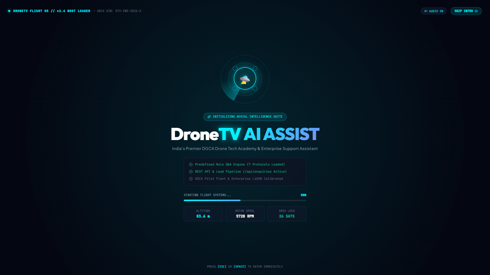
</kbd>
<br/>
<sub style="font-family: 'Bookman Old Style', 'URW Bookman', serif;"><b>◈ Figure 1.0:</b> Cinematic flight OS bootloader featuring live telemetry calibration, motor spool diagnostics (5,720+ RPM), satellite locks, and Web Audio turbine synthesis.</sub>

<br/><br/>

### ◈ 2. Home — Autonomous Drone Command Gateway
<kbd>
  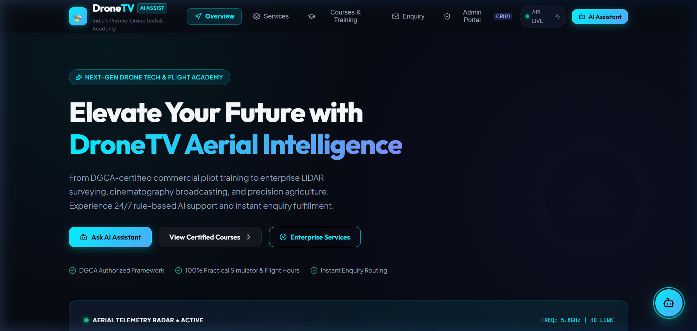
</kbd>
<br/>
<sub style="font-family: 'Bookman Old Style', 'URW Bookman', serif;"><b>◈ Figure 1.1:</b> Autonomous command landing gateway featuring live telemetry radar, animated quadcopter indicators, metrics HUD, and active Vector Drone Cursor.</sub>

<br/><br/>

### ◈ 3. Services & Training — 3D Physical Weight-Tilt Interaction
<kbd>
  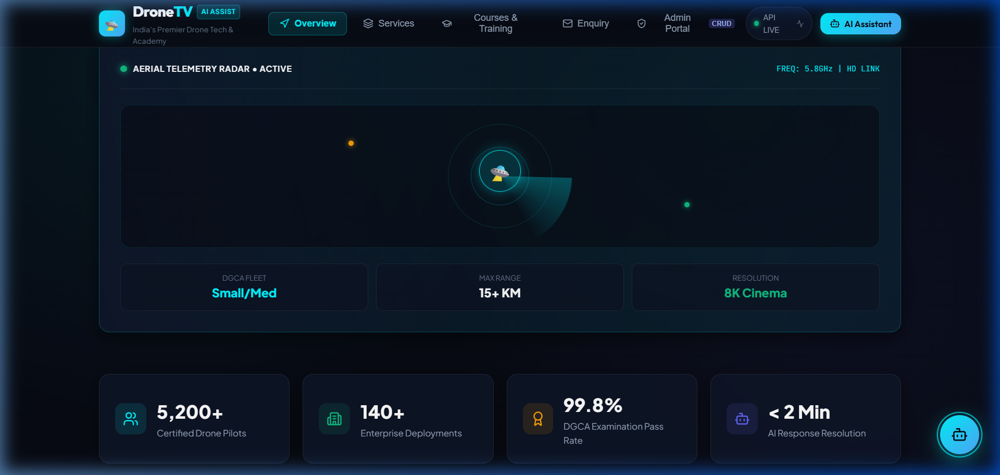
</kbd>
<br/>
<sub style="font-family: 'Bookman Old Style', 'URW Bookman', serif;"><b>◈ Figure 1.2:</b> Commercial service modules with interactive 3D perspective weight-tilt physics — the hovered corner sinks backward under cursor mass while the opposite edge lifts forward.</sub>

<br/><br/>

### ◈ 4. DroneTV AI Chatbot — Predefined Queries & Instant Intelligence
<kbd>
  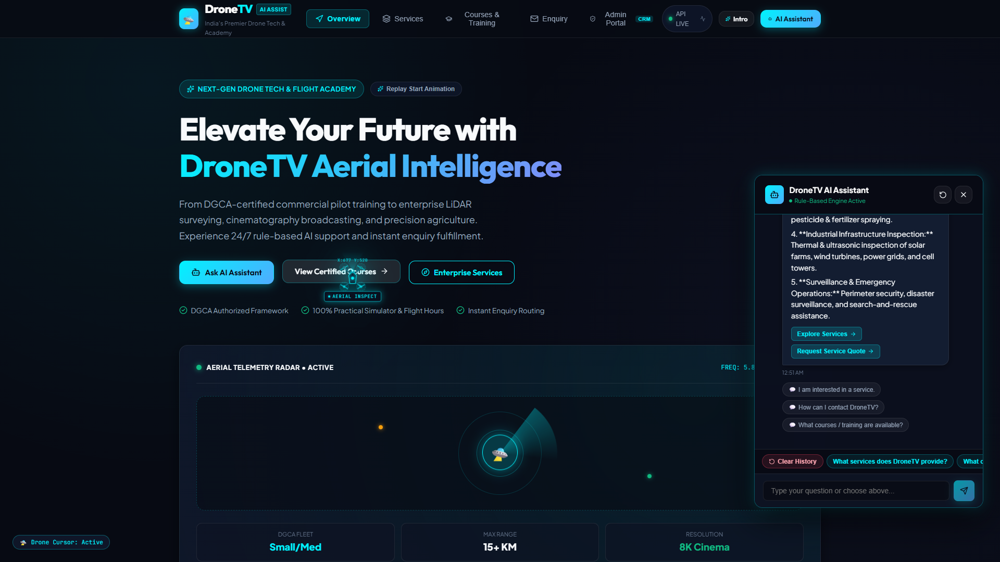
</kbd>
<br/>
<sub style="font-family: 'Bookman Old Style', 'URW Bookman', serif;"><b>◈ Figure 1.3:</b> Rule-based conversational assistant answering commercial aerial service inquiries with structured bullet responses, session persistence, and instant query chips.</sub>

<br/><br/>

### ◈ 5. Drone Academy & Courses — Interactive Lead Generation Flow
<kbd>
  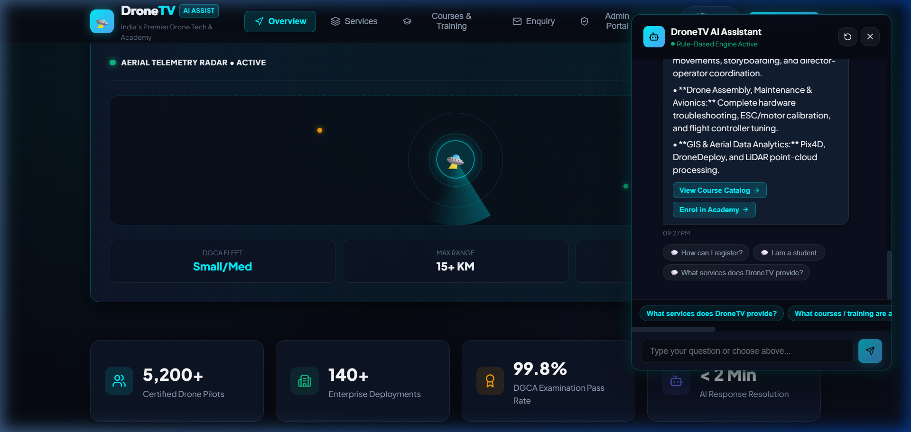
</kbd>
<br/>
<sub style="font-family: 'Bookman Old Style', 'URW Bookman', serif;"><b>◈ Figure 1.4:</b> DGCA Remote Pilot Certification queries with inline conversational lead intake form for direct student and customer registration.</sub>

<br/><br/>

### ◈ 6. Mission Control CRM — Administrative Intelligence Dashboard
<kbd>
  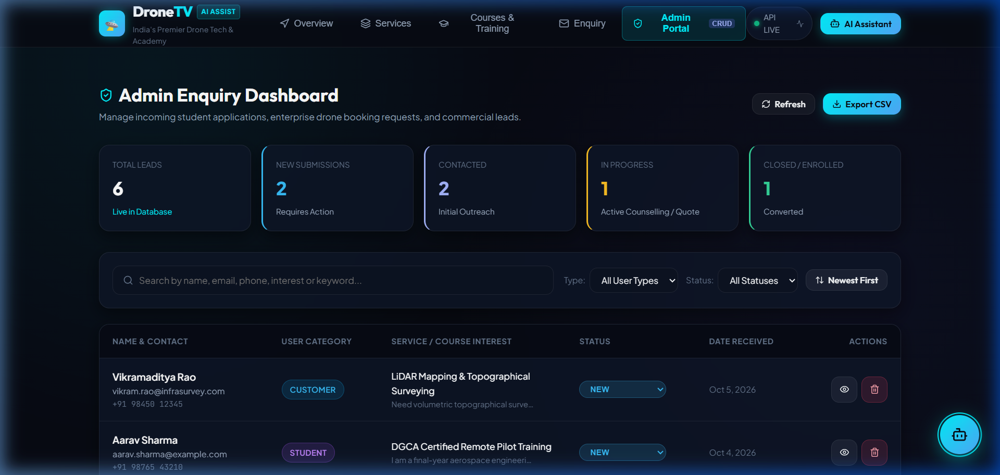
</kbd>
<br/>
<sub style="font-family: 'Bookman Old Style', 'URW Bookman', serif;"><b>◈ Figure 1.5:</b> Secured CRM command portal displaying total volume, pipeline lifecycle distribution (New, Contacted, In Progress, Closed), and rapid response actions.</sub>

<br/><br/>

### ◈ 7. Admin Intelligence — Real-Time Search & Segment Filtering
<kbd>
  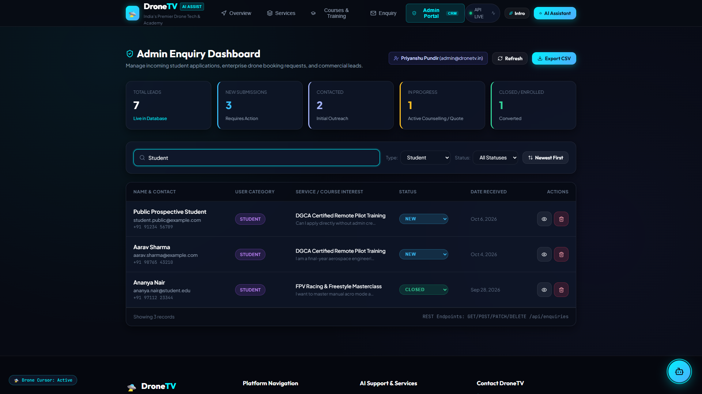
</kbd>
<br/>
<sub style="font-family: 'Bookman Old Style', 'URW Bookman', serif;"><b>◈ Figure 1.6:</b> Sub-millisecond client-side enquiry searching across names, emails, services, and multi-state tabs (`All`, `Student`, `Customer`).</sub>

<br/><br/>

### ◈ 8. Enquiry Inspector — Deep Payload Modal & Status Mutation
<kbd>
  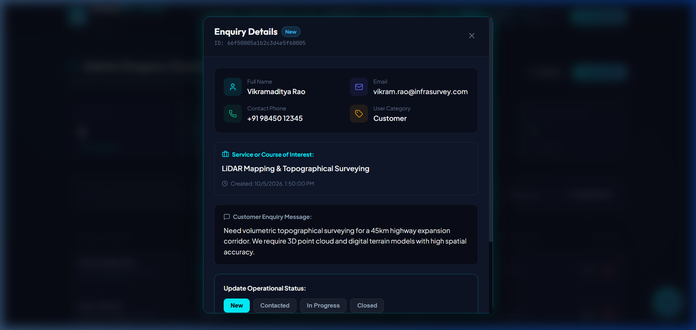
</kbd>
<br/>
<sub style="font-family: 'Bookman Old Style', 'URW Bookman', serif;"><b>◈ Figure 1.7:</b> Modal inspector revealing full sanitized message payloads, contact coordinates, audit timestamps, and one-click status transitions.</sub>

</div>

---

<h2 id="03-telemetry--architecture-metrics" style="font-family: 'Bookman Old Style', 'URW Bookman', 'Georgia', serif; color: #00ff99;">📊 03. Telemetry & Architecture Metrics</h2>

### 🥧 Query Intent & Chatbot Knowledge Distribution
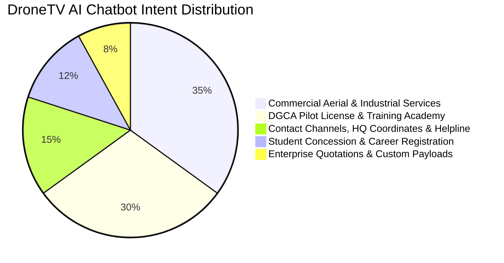

### 🛰️ Full-Stack Subsystem Execution Profile
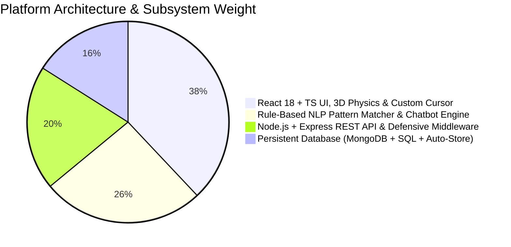

---

<h2 id="04-rule-engine--event-logic" style="font-family: 'Bookman Old Style', 'URW Bookman', 'Georgia', serif; color: #00ff99;">🔍 04. Rule Engine & Event Logic</h2>

<p style="font-family: 'Bookman Old Style', 'URW Bookman', serif; font-size: 1.02rem;">
The chatbot engine processes natural-language inputs via normalized token matching, regex boundary guards, and canonical intent classification:
</p>

| User Query / Event | Intent Classifier | State & Storage Mutation | Visual HUD Representation |
| :--- | :--- | :---: | :--- |
| **"What services does DroneTV provide?"** | `SERVICES_OVERVIEW` | Appends bot reply to session state | Rich bulleted card with 4K cinematography, LiDAR & spraying |
| **"What courses / training are available?"** | `COURSES_INFO` | Appends course syllabus + options | DGCA Pilot Certification & FPV racing modules with pricing |
| **"How can I contact DroneTV?"** | `CONTACT_CHANNELS` | Appends official contact payload | Verified phones (+91 88043 49999), email & Dehradun HQ |
| **"How can I register?"** | `REGISTRATION_FLOW` | Opens inline lead intake form | Direct step-by-step registration instructions + form button |
| **"I am interested in a service."** | `SERVICE_QUOTE` | Pre-selects 'Customer' user type | Directs user to customized enterprise quotation intake |
| **"I am a student."** | `STUDENT_PATH` | Pre-selects 'Student' user type | Shows student concession details & academic pilot syllabus |
| **"I want to speak with someone."** | `AGENT_HANDOFF` | Flags lead priority as High | Dispatches instant callback request prompt with phone line |
| **Unmatched / Free Query** | `FALLBACK_HANDLER` | Logs query for analytical review | Graceful fallback card with 3 suggested quick query buttons |
| **Reset Conversation Click** | `CLEAR_SESSION` | Wipes session storage history | Sound effect triggers + fresh welcoming telemetry prompt |
| **Lead Form Submission** | `POST /api/enquiries` | Persistent record inserted into DB | Audio chime + success toast + real-time Admin CRM increment |
| **3D Card Edge Hover** | `calcWeightTilt()` | Direct 3D matrix transform | Hovered corner sinks into screen (`perspective: 1100px`) |
| **Cursor Velocity Vector** | `physicsContrailLoop()` | Spawns smooth particle ribbon | Quadcopter banks smoothly along motion trajectory |

> [!TIP]
> **Defensive Session Persistence**: Chat history is persisted in browser session storage so navigation between the Landing Page, Services, and Course sections retains full conversational context without losing prior interactions.

---

<h2 id="05-system-architecture" style="font-family: 'Bookman Old Style', 'URW Bookman', 'Georgia', serif; color: #00ff99;">🧬 05. System Architecture</h2>

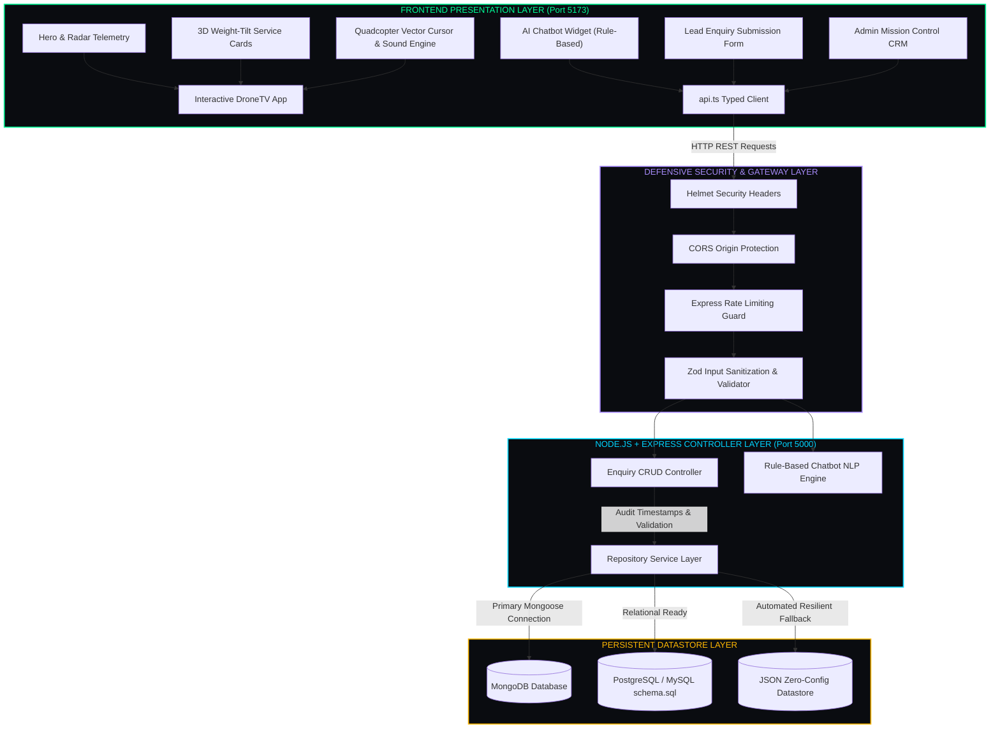

---

<h2 id="06-rest-api--endpoints" style="font-family: 'Bookman Old Style', 'URW Bookman', 'Georgia', serif; color: #00ff99;">📡 06. REST API & Endpoint Contracts</h2>

<p style="font-family: 'Bookman Old Style', 'URW Bookman', serif; font-size: 1.02rem;">
The backend exposes a strictly typed, standard RESTful API adhering to HTTP semantics and status codes:
</p>

| Method | Endpoint | Description | Payload / Query Params | Success Response |
| :---: | :--- | :--- | :--- | :---: |
| **`GET`** | `/api/health` | Service uptime and DB connection monitor | None | `200 OK` |
| **`GET`** | `/api/enquiries` | Retrieve enquiries with search & filters | `?search=term&userType=Student&status=New` | `200 OK` |
| **`GET`** | `/api/enquiries/stats/summary`| Aggregated pipeline metrics for CRM KPI cards | None | `200 OK` |
| **`GET`** | `/api/enquiries/:id` | Fetch single enquiry by ID | Path param: `id` | `200 OK` |
| **`POST`** | `/api/enquiries` | Create new validated lead enquiry | `{ name, email, phone, userType, serviceOrCourse, message }` | `201 Created` |
| **`PATCH`** | `/api/enquiries/:id` | Update enquiry status or admin notes | `{ status: "Contacted", adminNotes?: string }` | `200 OK` |
| **`DELETE`**| `/api/enquiries/:id` | Permanently remove an enquiry | Path param: `id` | `200 OK` |
| **`GET`** | `/api/chat/questions` | Get canonical predefined question list | None | `200 OK` |
| **`POST`** | `/api/chat/message` | Process query through NLP rule engine | `{ message: string }` | `200 OK` |

### 🛡️ Defensive Security Implementations
- **Dual-Layer Validation**: Frontend React form validates constraints before dispatch; backend Express middleware strictly validates payload structure via RFC-compliant patterns.
- **Input Sanitization**: Strips HTML entities and dangerous script characters to prevent persistent XSS injection attacks.
- **DDoS Mitigation**: `express-rate-limit` enforces a window threshold to safeguard public endpoints against brute force attempts.
- **CORS & HTTP Headers**: Restricted origins with `helmet` defense headers protecting against MIME sniffing and clickjacking.
- **Safe Error Shielding**: Production errors never leak file paths, database connection strings, or call stacks.

---

<h2 id="07-directory-structure" style="font-family: 'Bookman Old Style', 'URW Bookman', 'Georgia', serif; color: #00ff99;">📂 07. Directory Structure</h2>

<p style="font-family: 'Bookman Old Style', 'URW Bookman', serif; font-size: 1.02rem;">
The repository strictly mirrors the <b>7 canonical submission subfolders</b> prescribed by the IPAGE Group technical evaluation rubric:
</p>

```
FullStack_Chatbot_Task_Priyanshu_Pundir/
├── 📁 01_Source_Code/
│   ├── 📁 backend/                        # Node.js + Express + TypeScript REST API
│   │   ├── src/
│   │   │   ├── config/                    # Database connection & environment constants
│   │   │   ├── controllers/               # Enquiry CRUD & Chatbot HTTP handlers
│   │   │   ├── middleware/                # Validation, error obscuring & rate limits
│   │   │   ├── models/                    # Mongoose schemas & fallback datastore
│   │   │   ├── routes/                    # Express REST route handlers
│   │   │   ├── services/                  # Rule-based chatbot NLP pattern engine
│   │   │   ├── scripts/seed.ts            # Realistic DroneTV mock data seeder
│   │   │   └── server.ts                  # Express application entrypoint
│   │   ├── package.json
│   │   └── tsconfig.json
│   ├── 📁 frontend/                       # React 18 + TypeScript + Vite Application
│   │   ├── src/
│   │   │   ├── assets/                    # Aerospace vectors & branding
│   │   │   ├── components/
│   │   │   │   ├── AdminDashboard.tsx     # Mission Control CRM with live search & filters
│   │   │   │   ├── ChatbotWidget.tsx      # Rule-based conversational AI widget
│   │   │   │   ├── CustomCursor.tsx       # Quadcopter cursor with spinning rotors & trail
│   │   │   │   ├── WeightTiltCard.tsx     # 3D physical weight-tilt card wrapper
│   │   │   │   ├── DroneTVIntroAnimation.tsx # Cinematic radar boot & turbine audio intro
│   │   │   │   ├── EnquiryDetailModal.tsx # Deep inspection modal & status updater
│   │   │   │   ├── EnquiryForm.tsx        # Validated dual-audience lead capture form
│   │   │   │   ├── Hero.tsx               # Aerospace hero section with live telemetry
│   │   │   │   ├── ServicesSection.tsx    # 3D interactive commercial drone services
│   │   │   │   └── CoursesSection.tsx     # DGCA flight academy course modules
│   │   │   ├── services/api.ts            # Centralized typed HTTP API service
│   │   │   ├── utils/soundEffects.ts      # Web Audio synthesized sound engine
│   │   │   ├── index.css                  # Cyber-aerospace design system tokens
│   │   │   └── App.tsx                    # Master layout & view controller
│   │   ├── package.json
│   │   └── vite.config.js
│   └── package.json                       # Monorepo runner for concurrent development
├── 📁 02_Screenshots/                     # 7 Full-HD verified interface screenshots
├── 📁 03_API_Documentation/               # Comprehensive REST API guide & Postman Collection
├── 📁 04_Database/                        # PostgreSQL schema.sql, MongoDB schema & seed data
├── 📁 05_Video_Walkthrough/               # 5-10 minute presentation guide, script & link file
├── 📁 06_GitHub/                          # Repository link & Git submission guide
├── 📁 07_Resume/                          # Priyanshu Pundir updated resume PDF & guide
├── .gitignore                             # Secret & build artifact exclusion rules
└── README.md                              # Primary master platform documentation
```

---

<h2 id="08-quick-start" style="font-family: 'Bookman Old Style', 'URW Bookman', 'Georgia', serif; color: #00ff99;">🚀 08. Quick Start</h2>

### 📋 Prerequisites
- **Node.js**: `v18.x` or higher (`v20+` recommended)
- **npm**: `v9.x` or higher
- Modern Chromium or Gecko Browser (**Chrome**, **Edge**, **Firefox**, **Brave**)

### 🛠️ Option 1: Run Full Stack Concurrently (Recommended)

From the `01_Source_Code` directory, launch both the Node.js API (Port 5000) and the React Frontend (Port 5173) in one synchronized process:

```bash
# 1. Clone repository
git clone https://github.com/PriyanshuPundir01/FullStack_Chatbot_Task_Priyanshu_Pundir.git

# 2. Navigate to source code root
cd FullStack_Chatbot_Task_Priyanshu_Pundir/01_Source_Code

# 3. Install all dependencies (frontend + backend)
npm install

# 4. Launch both servers concurrently
npm run dev
```

### 🛠️ Option 2: Run in Separate Terminals

#### Terminal 1 — Backend API
```bash
cd FullStack_Chatbot_Task_Priyanshu_Pundir/01_Source_Code/backend
npm install
npm run seed      # Populates realistic DroneTV commercial & student leads
npm run dev       # Starts server on http://localhost:5000
```

#### Terminal 2 — Frontend Application
```bash
cd FullStack_Chatbot_Task_Priyanshu_Pundir/01_Source_Code/frontend
npm install
npm run dev       # Starts Vite dev server on http://localhost:5173
```

### 🌐 Access Points & Credentials
- **Frontend Portal**: [http://localhost:5173](http://localhost:5173)
- **Backend Health Check**: [http://localhost:5000/api/health](http://localhost:5000/api/health)
- **Admin CRM Credentials**:
  - **Username**: `admin`
  - **Password**: `dronetv2025`

---

<h2 id="09-operational-workflows" style="font-family: 'Bookman Old Style', 'URW Bookman', 'Georgia', serif; color: #00ff99;">🎮 09. Operational Workflows</h2>

### 🛸 1. Customer & Student Engagement Flow
1. **Explore**: Navigate through Hero telemetry, 3D interactive service cards, and training academy syllabi.
2. **Engage Assistant**: Click the floating quadcopter chatbot icon at the bottom right to open the AI Support Assistant.
3. **Trigger Quick Queries**: Click predefined buttons such as *"What services does DroneTV provide?"* or *"What courses / training are available?"* for instantaneous replies.
4. **Submit Lead**: Submit an inquiry either via the in-chat guided form or the standalone validated Enquiry Form.
5. **Confirmation**: Receive instant acoustic confirmation, validation green lights, and a unique tracking reference.

### 🛡️ 2. Admin Triage & Pipeline Mutation Flow
1. **Access CRM**: Click **Admin Portal** in the navigation bar and authenticate using credentials (`admin` / `dronetv2025`).
2. **Review Metrics**: Inspect KPI metric cards displaying total lead volume and breakdown across `New`, `Contacted`, `In Progress`, and `Closed`.
3. **Filter & Search**: Type any candidate name, email, or course name into the real-time search field; results update instantaneously.
4. **Deep Inspection**: Click the **View** icon on any enquiry row to inspect full message bodies, timestamp audits, and contact coordinates.
5. **Update Status**: Transition the lead status using the selector; changes persist immediately to the database.

### ⌨️ Keyboard Shortcuts & HUD Controls
| Key | Action | Context |
| :---: | :--- | :--- |
| **`Enter`** | Send message to AI Chatbot | Inside Chatbot text input |
| **`Escape`** | Close active Modal or Chatbot window | Global across all pages |
| **`Tab`** | Move to next form field | Inside lead submission form |
| **`Hover`** | Apply 3D physical weight tilt | Service & Course cards |

---

<h2 id="10-candidate--submission" style="font-family: 'Bookman Old Style', 'URW Bookman', 'Georgia', serif; color: #00ff99;">📞 10. Candidate & Connect</h2>

<p style="font-family: 'Bookman Old Style', 'URW Bookman', serif; font-size: 1.02rem;">
This project was designed, developed, and submitted by <b>Priyanshu Pundir</b> in fulfillment of the practical technical evaluation for the <b>Full Stack Developer Intern</b> role at <b>IPAGE Group</b>.
</p>

- **Candidate Name:** Priyanshu Pundir
- **Position Applied:** Full Stack Developer Intern
- **Company / Evaluator:** IPAGE Group — Talent & Engineering
- **Email:** `priyanshupundir36@gmail.com`
- **Phone:** `+91 9548014400`
- **Office / Address:** Pundir Office, Bhagwan Singh Complex, 788, Gularghati Rd, Nathuwawala, Dehradun, Uttarakhand 248008
- **GitHub Repository:** [https://github.com/PriyanshuPundir01/FullStack_Chatbot_Task_Priyanshu_Pundir](https://github.com/PriyanshuPundir01/FullStack_Chatbot_Task_Priyanshu_Pundir)
- **Video Walkthrough:** [Google Drive Video Demo (5–10 min)](https://drive.google.com/file/d/1wegXzvxixzkn-oJfcNOio3Co5NpTpDEN/view?usp=sharing)
- **Reference Context:** Inspired by [DroneTV.in](https://dronetv.in/)

---

<h2 id="11-license" style="font-family: 'Bookman Old Style', 'URW Bookman', 'Georgia', serif; color: #00ff99;">📜 11. License</h2>

Distributed under the **[MIT License](LICENSE)**.

<div align="center">

---

⭐ **Star this repository if you love Aerospace Engineering & Autonomous Web Systems!** ⭐

<p style="font-family: 'Bookman Old Style', 'URW Bookman', serif; color: #64748b; margin-top: 8px;">
  Crafted with ❤️ and aerospace passion by <b>Priyanshu Pundir</b> 🛸⚡
</p>

</div>
